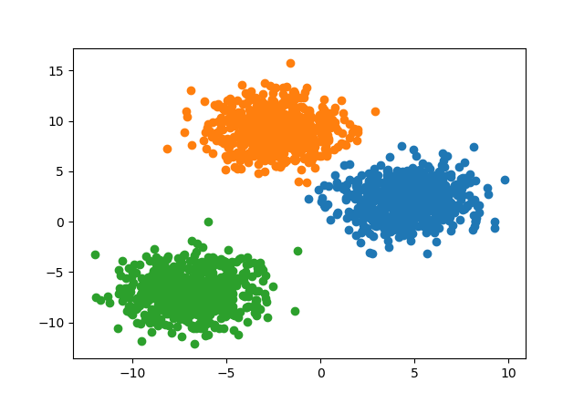

# My Machine Learning ToolBox

I developed this machine learning toolbox for education purposes, Especially for beginners who want to learn implementation of popular machine learning algorithms
### 1. Clustering 
##### 1.1 Kmeans

